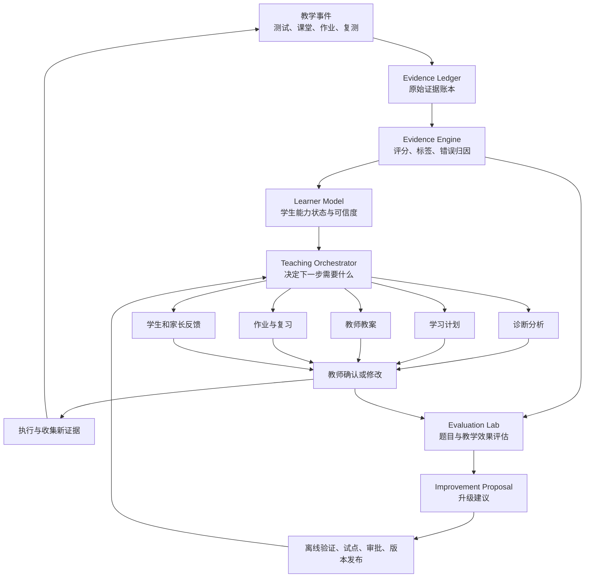

# 智能化 AI Teaching Harness 架构 v1

## 1. 设计结论

这套系统不应发展成“一个万能AI自动做所有事情”，而应该采用：

> 一个教学编排器 + 多个专业能力模块 + 一个不可篡改的证据层 + 教师审批与版本治理。

AI可以自动分析、推荐、生成、调整和提出升级方案，但不得直接修改原始学习证据、官方标准、正式成绩或生产策略。

系统的智能程度来自三个循环：

1. 学生循环：根据新证据持续调整学生状态和下一步教学行动；
2. 教学循环：比较不同教学方法的结果，优化教案与作业策略；
3. 系统循环：根据题目表现、教师修改和教学结果，提出题库、规则和AI策略的新版本。

## 2. 总体结构



## 3. 七层架构

### 第一层：原始证据层

只记录实际发生过的事实：

- 学生答案、作文、录音；
- 每题用时、听力播放次数；
- 是否获得提示；
- 课堂勾选与教师原始备注；
- 作业提交与修改记录；
- 前测、后测、延迟复测；
- 教师对AI建议的接受、修改或拒绝。

原则：原始证据只能追加，不能被AI覆盖。

### 第二层：能力与知识图谱

每个能力节点保存：

- 年级和关键阶段；
- 所属领域；
- 具体子技能；
- 前置能力；
- 可观察表现；
- 可用题型；
- 常见错误；
- 成功标准；
- 官方来源或教师来源；
- 版本和审核状态。

示例：

```text
阅读推断
├── 找到相关信息
├── 区分事实与推测
├── 连接两条证据
├── 判断语气强度
└── 解释证据为什么支持答案
```

### 第三层：学生状态模型

学生状态不是一个总分，而是每个能力节点的状态：

```text
掌握等级
证据数量
最近证据
证据类型
独立程度
是否能迁移
是否经过延迟复测
可信度
重复错误
下一次复习时间
```

建议状态：

```text
0 未评估
1 尚未形成
2 提示下完成
3 独立完成
4 迁移使用
5 延迟后稳定掌握
```

AI不能因为一次正确就把能力改成5。稳定掌握至少需要：

- 多次证据；
- 两种以上任务情境；
- 一次独立表现；
- 一次延迟或迁移表现。

### 第四层：教学编排器

编排器负责回答：

1. 现在发生了什么事件？
2. 哪些学生状态需要更新？
3. 是否需要教师确认？
4. 下一项教学行动是什么？
5. 需要调用哪个专业模块？

它不直接生成所有内容，而是调度专业模块，并检查结果之间是否一致。

### 第五层：专业AI模块

| 模块 | 输入 | 输出 |
|---|---|---|
| Evidence Analyst | 学生答案、评分规则 | 分题得分、证据、错误类型 |
| Diagnostic Analyst | 分题结果、能力图谱 | 具体薄弱点、前置缺口、可信度 |
| Student Modeler | 新证据、历史状态 | 状态更新建议 |
| Planning Agent | 目标、时间、学生状态 | 4–8课滚动学习计划 |
| Lesson Agent | 计划、上节课表现 | 可直接授课的教师教案 |
| Assignment Agent | 本课目标、错误情况 | 预习、作业、间隔复习 |
| Feedback Agent | 课堂和作业证据 | 教师、学生、家长三个版本反馈 |
| Content QA | 新题、答案、规范 | 歧义、难度、答案和标签检查 |
| Evaluation Agent | 前后测、教师修改、题目统计 | 教学和内容改进建议 |

这些模块不应该各自保存“私人记忆”。它们使用同一份学生状态和证据引用，避免多个Agent产生互相矛盾的学生画像。

### 第六层：教师控制层

所有重要AI输出包含统一结构：

```text
结论
证据编号
可信度
其他可能解释
建议行动
是否需要教师确认
使用的规则或策略版本
```

教师可以：

- 接受；
- 修改；
- 拒绝；
- 标记AI判断错误的原因。

教师的修改不是简单覆盖，而会成为系统改进数据。

### 第七层：系统评估与升级层

系统可以提出升级，但升级必须经过：

```text
发现问题
→ 生成候选改进
→ 离线历史数据验证
→ 质量规则检查
→ 教师审批
→ 少量学生影子运行
→ 小范围试点
→ 正式发布新版本
→ 持续监控
→ 必要时回滚
```

## 4. “自己升级”应该如何实现

### A. 学生层自动适应

可以高度自动化：

- 新作业完成后更新薄弱点；
- 自动安排间隔复习；
- 自动增减作业难度；
- 自动调整未来两节课的建议；
- 达不到成功标准时回到前置能力；
- 达到标准时进入迁移任务。

约束：改变长期方向或正式能力等级时需要教师确认。

### B. 教学策略自动优化

系统记录：

- 学生初始状态；
- 使用了什么教法；
- 提示强度；
- 课堂表现；
- 作业、后测和延迟复测结果。

当数据足够时，系统可以发现：

```text
对这名学生：
先示范再练习，比先讲规则的保持率更高。

对相似学生群体：
推断题在加入“证据解释”步骤后，延迟复测提高。
```

系统只能将其作为候选教学策略，不能把相关性直接当作因果关系。

### C. 题库自动优化

每道题持续计算：

- 正确率与题目难度；
- 高低能力学生的区分情况；
- 各干扰项是否有效；
- 平均用时和放弃率；
- 教师改判率；
- 学生投诉或歧义标记；
- 同一能力的前后测一致性。

系统据此建议：

- 保留；
- 修改题干；
- 修改干扰项；
- 调整难度；
- 改能力标签；
- 暂停使用；
- 生成平行题；
- 进入教师审核。

AI生成的新题默认只能进入“草稿题库”，不能直接进入正式诊断或复测。

### D. AI规则和提示自动升级

系统收集：

- 教师接受率；
- 教师修改内容；
- 错误判断类型；
- 生成教案是否被实际使用；
- 作业是否需要大量人工修改；
- 新策略是否改善延迟和迁移表现。

Evaluation Agent可以生成新规则或新提示词候选版本，但必须通过固定评测集。禁止系统直接重写当前生产提示并立即启用。

## 5. 证据评分而不是简单平均分

同一个“答对”具有不同价值：

| 证据 | 参考权重方向 |
|---|---|
| 在教师逐步提示下答对 | 较低 |
| 熟悉题型中独立答对 | 中等 |
| 新材料中独立答对 | 较高 |
| 一周后仍答对 | 较高 |
| 写作或口语中主动运用 | 很高 |

系统可以使用以下概念计算证据强度：

```text
证据强度 = 正确程度
         × 难度权重
         × 独立程度
         × 迁移权重
         × 时间保持权重
         × 评分可信度
```

第一版不必使用复杂机器学习。先使用透明规则，积累足够真实数据后，再校准权重。

## 6. 事件驱动自动化

系统围绕事件工作：

| 事件 | 自动动作 |
|---|---|
| DiagnosticSubmitted | 自动评分、分题归因、创建教师复核任务 |
| TeacherReviewConfirmed | 更新能力证据、生成学习计划候选 |
| PlanApproved | 生成下一课教案、预习和作业草稿 |
| PreworkSubmitted | 调整教案中的难度和课堂分支 |
| LessonCompleted | 生成反馈、提出学生状态更新 |
| HomeworkSubmitted | 批改、分析重复错误、调整下一课 |
| StageTestCompleted | 生成趋势、教学效果和家长报告 |
| TeacherOverrideRecorded | 进入AI错误分析和策略改进队列 |
| ItemQualityAlerted | 暂停题目或进入题目审核队列 |

每个自动动作必须可追踪、可重跑、可撤销。

## 7. 推荐数据结构

### 核心业务数据

```text
students
student_goals
competency_nodes
competency_prerequisites
assessment_versions
items
item_skill_tags
attempts
item_results
evidence_events
mastery_states
mastery_state_history
learning_plans
lesson_plans
lesson_records
assignments
assignment_attempts
feedback_reports
```

### AI与升级数据

```text
ai_runs
ai_decisions
teacher_overrides
policy_versions
prompt_versions
improvement_proposals
evaluation_runs
experiments
experiment_results
audit_log
```

### 文件数据

作文附件、录音、PDF、课件等放在对象存储；数据库只保存文件编号、学生归属、用途、版本和访问权限。

## 8. 产品界面结构

### 教师首页

- 今天的课程；
- 待复核诊断；
- 待批改开放题；
- 学生风险提醒；
- 等待确认的AI建议；
- 需要复习的能力；
- 教学效果异常提醒。

### 学生页面

- 当前目标；
- 具体能力地图；
- 最近学习证据；
- 当前三个教学重点；
- 近期计划；
- 历次课堂、作业和测验；
- 学生与家长报告。

### 课程工作台

- 上节课结果；
- 本课教师教案；
- 预习结果；
- 课堂分支；
- 教学材料；
- 90秒课后勾选；
- 作业调整与发布。

### AI改进中心

- AI建议接受率；
- 教师经常修改的内容；
- 有问题的题目；
- 候选题目和平行卷；
- 教学策略候选；
- 待审批的策略版本；
- 试点结果和回滚入口。

## 9. 自动化权限分级

### 可自动执行

- 客观题评分；
- 草稿保存；
- 统计错误；
- 安排复习提醒；
- 生成计划、教案、作业和反馈草稿；
- 标记异常题目；
- 提出学生状态更新。

### 需要教师一次确认

- 正式能力等级变化；
- 四课学习计划；
- 教师教案和作业发布；
- 写作、口语最终评分；
- 家长报告发布；
- AI生成题目进入正式题库。

### 需要管理员审批和版本发布

- 修改能力标准；
- 修改评分规则；
- 更换核心AI策略；
- 自动化权限扩大；
- 题库大批量替换；
- 数据保留和隐私策略变化。

### 永不允许自动执行

- 修改或删除原始学生证据；
- 未经审核发布新评分标准；
- 因一次结果永久降低学生预期；
- 自动对外发送负面评价；
- 自动修改生产代码并部署；
- 使用真实学生数据训练外部模型而没有授权。

## 10. 四阶段实施路线

### Phase 1：可解释的教学闭环

目标：先让数据真正连起来。

- 学生实体；
- 分题结果；
- 子技能标签；
- 证据事件；
- 学生状态；
- 教师逐题复核；
- 四课计划；
- 下一课教师教案；
- 课后勾选；
- 作业结果回写。

这一阶段以透明规则为主，不急于复杂机器学习。

### Phase 2：高度自动化

- 事件触发自动流程；
- 自动生成和调整教案；
- 机器友好作业；
- 间隔复习；
- 学生和家长报告；
- 教师只处理异常和需判断内容。

### Phase 3：数据驱动优化

- 题目难度和质量统计；
- 教师改判分析；
- 教学策略效果比较；
- 平行卷校准；
- 推荐更合适的教学活动。

### Phase 4：受控自学习

- AI生成升级候选；
- 历史数据离线评测；
- 影子运行；
- 小范围试点；
- 人工批准发布；
- 自动监控和回滚。

## 11. 下一版最小范围

下一版只实现一个完整闭环：

```text
虚拟或真实匿名学生
→ 一次诊断
→ 分题与子技能复核
→ 学生状态
→ 四课计划
→ 下一课教师教案
→ 课后勾选
→ 一份作业
→ 自动批改
→ 状态更新
→ 下一课调整
```

先跑通这条链，再增加大规模题目生成和系统自升级。否则数据链没有建立，AI只会生成越来越多无法验证质量的内容。
